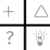
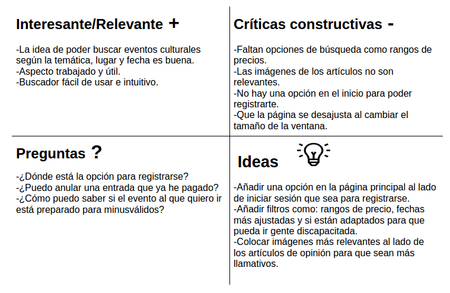

# DIU- Trabajo Final

Trabajo final Diseño de Interfaces de Usuario 2020-21 

Curso: 2020/21 

Proyecto: Yuzin

Descripción: Se va a analizar la página web de Yuzin (https://yuzin.com) para intentar mejorarla aportando nuevas ideas de diseño. En dicho análisis se intentará sacar los puntos negativos de la página y a partir de ellos ir trabajando para mejorar la página web.

Logo: </img>

Miembro
 * :bust_in_silhouette:  Guillermo Torres Fernández

----- 

En esta actividad final se estudiará una plataforma de un periódico digital y a partir de su análisis se realizará una propuesta para su diseño Web.

Un periódico digital es una plataforma en la cual se suben noticias, articulos, etc. Dependiendo del periodico tendrán una distinta tematica las cosas que se suban a la página. Los periódicos digitales son una evolución de los periodicos normales, ya que son mucho mas accesibles.

# Proceso de Diseño

## Paso 1. UX Desk Research & Análisis

 1.a Competitive Analysis
-----

Se ha elegido una aplicación web llamada ***Yuzin*** cuyo propósito es dar al usuario una información sobre eventos culturales. Te da la posibilidad de buscar el tipo de evento que buscas, en que fechas y el lugar.

 1.b Usability Review
----

- Enlace al documento:  [Usability Review](Usability-review.pdf)
- Valoración final (numérica): 65/100 - *Moderate*
- Comentario sobre la valoración: Es una página cuya idea está muy bien reflejada ya que cumple el objetivo de ayudar al usuario a buscar un evento y artículos de opinión pero su interfaz y la busqueda no termina de ayudar a la experiencia de dicho usuario ya que son un poco ineficientes.

 1.c Accesibility
----

En cuanto a la accesibilidad, es un factor importantísimo para una página web y que Yuzin no cumple, ya que no tiene nada de información sobre este tema.
La accesibilidad es necesaria ya que tiene como objetivo lograr que las páginas web sean utilizables por el máximo número de personas, independientemente de sus conocimientos o capacidades personales.
En breves palabras, para una persona con discapacidad visual, auditiva, motórica o cognitiva es muy complicado navegar por esta página sin ayuda.
Por lo tanto la accesibilidad es de lo primero en incluir en el nuevo diseño de la página web.

## Paso 2. UX Design  

 2.a Feedback Capture Grid
----

Lo más importante sería corregir el buscador para que tenga un filtrado mas específico, arreglar la página para que no se desajuste al cambiar el tamaño de la ventana y que aparezca en la página principal la opción de registrarse.

 2.b Tasks & Sitemap 
-----

 2.c Labelling 
----

## Paso 3. Mi equipo UX-Case Study 

  3.a Logotipo
----
</img>

Del logotipo se dejaría como está para mantener la esencia de cómo empezó la aplicación web pero se cambiaría el color. El nuevo color del logo sería el rojo. Tambíen se añadiría alrededor del logo una elipse para hacerlo más llamativo.

 3.b Guidelines
----
Para facilitar la lectura, se usaría la tipografía "Sans-Serif", ya que es una opción muy legible y que llama al usuario a seguir leyendo. Otra opción es usar la tipografía San Francisco para distinguir los títulos o subtítulos del texto.

Vamos a ser lógicos con la identidad de la marca por lo que la paleta de colores a utilizar tiene que ser muy parecida a la ya utilazada en la página.
Se utilizará la [paleta de colores nº 3004][paleta] que es una combinación muy atractiva y sotisficada y que sigue con las tonalidades rojizas, esencia de la página web. Estas tonalidades crean una combinación original.

Las ideas en cuanto a los guidelines para la página web serían las siguientes:
- Breadcrumb: esto puede mejorar en gran medida la forma en que los usuarios encuentran su camino. En términos de usabilidad, los breadcrumbs reducen el número de acciones que un usuario necesita para llegar a una página de nivel superior, y mejoran la capacidad de búsqueda de las secciones y páginas del sitio web.
- Cambiar el diseño del buscador, añadiéndole algún patrón o dibujo que lo destaque y quede más llamativo. También es importante que el buscador sea accesible en todo momento, sin importar la página en la que nos encontremos.
- Añadir a la página de las tarifas una tabla de precios, para que se pueda diferenciar claramente entre características y precios de las diferentes tarifas.

- Introducir una pequeña galería de imágenes sobre las oficinas y las salas que la página está ofreciendo para que el usuario tenga una idea de lo que va a adquirir.

Es muy importante el uso de Guidelines que se adecúen perfectamente al objetivo de la aplicación web ya que van a ayudar  al usuario a la hora de interactuar con la interfaz y que su experiencia con la página sea lo más satisfactoria posible. De esta manera se consigue que el usuario quede satisfecho y pueda compartir la página con otras personas.

[paleta]: https://paletasdecolores.com/paleta-de-colores-3004/

